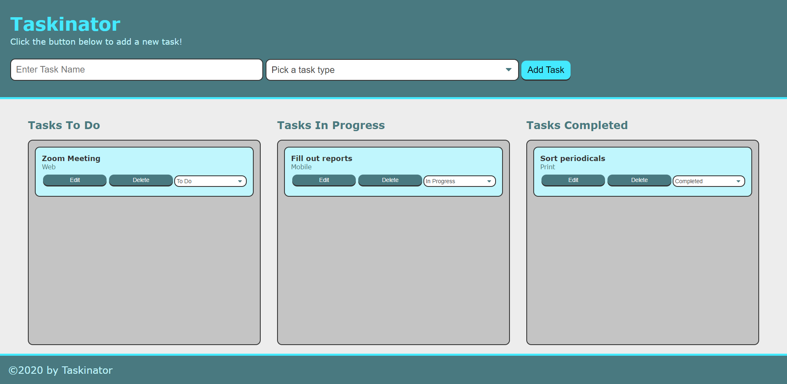

# Taskinator

## Table of Contents
* [Deployed](#deployed)
* [Technologies](#technologies)
* [Description](#description)
* [Preview](#preview)
* [Questions](#questions)
* [Credits](#credits)

## Deployed
Access the application at https://sarawrmas.github.io/taskinator/

## Technologies
* HTML
* CSS
* JavaScript

## Description
Taskinator is a simple application that allows you to keep track of tasks. To use, simply enter the name of your task at the prompt, select the task type, and hit submit. Your task will automatically appear in the Tasks To Do box, but you can change its status by selecting from the dropdown in the task box. If you need to edit your task name or type, click "Edit" and the Enter Task Name prompt will refill with the existing information that can then be updated and saved. To delete a task, select Delete from the task's options.

## Preview

## Questions
Have questions about this project?  
GitHub: https://github.com/sarawrmas  
Email: sara.m.adamski@gmail.com

## Credits
Sara Adamski